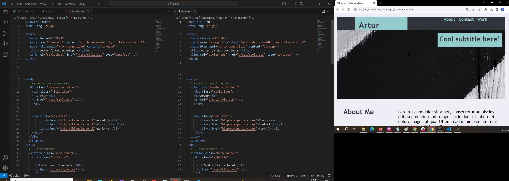

# Challange2
Week 2 challange
# Portfolio

This portfolio showcases my projects and demonstrates the use of flexbox for layout design.

## Description

utilization of flexbox for creating responsive and dynamic layouts. The projects included here highlight the versatility and power of flexbox in structuring content and achieving adaptable designs across various screen sizes.

## Projects

### Project 2: [Challange2]
Description: Briefly describe the second project and its significance.

### ...

## Technologies Used

- HTML5
- CSS3 (with Flexbox)

## Features

- Responsive layouts using flexbox.
- Demonstrations of flexible and adaptive content placement.
- Utilization of flexbox properties for managing layout structures.

## Setup and Usage

1. Clone the repository.
2. Open the project in your preferred code editor.
3. Explore the individual projects to understand the implementation of flexbox in layout design.

## Contributing

If you'd like to contribute to this portfolio or provide feedback, please feel free to submit issues or pull requests.

## Acknowledgements

- Credits to any resources, tutorials, or frameworks used in learning and implementing flexbox layouts.
- Acknowledgements to any contributors or inspirations for the showcased projects.

## License

This project is licensed under the [MIT] License - see the [LICENSE.md]